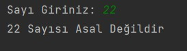
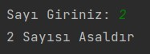
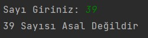
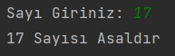

# Recursive Metot ile Asal Sayılar
Java dilinde "Recursive" metot kullanarak, kullanıcıdan alınan sayının "Asal" sayı olup olmadığını bulan programı yazın.

## Senaryolar
### Senaryo 1

### Senaryo 2

### Senaryo 3

### Senaryo 4
